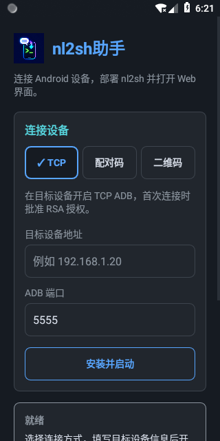
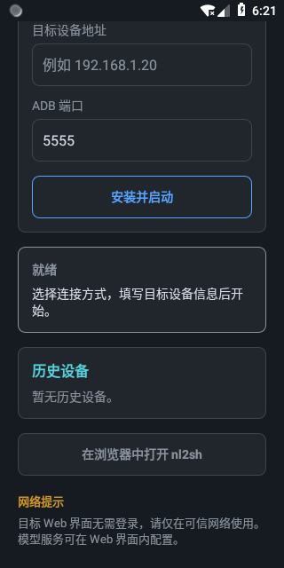

# 界面与视觉规范

助手沿用 nl2sh 的深色界面、灰白正文和青蓝交互层级，系统浅色模式下也保持一致。图标保留品牌蓝紫渐变，应用内功能界面使用统一语义色板。

连接区的 TCP ADB、配对码、二维码按钮使用勾号和蓝色边框标明当前方式；配对码与二维码均用于 Android 无线调试。选中按钮仍可点击，只有执行任务时才禁用切换、输入和部署，并显示“正在处理…”。

状态区分别显示“就绪”“处理中”“已启动”“需注意”“失败”。蓝色代表处理中，绿色只用于确认启动成功，黄色用于注意事项，红色用于错误；详细信息保持灰白，不依赖颜色判断结果。配对成功但未发现连接服务会提示“需注意”。保存的上次 URL 不代表目标服务当前在线。

历史设备按连接方式分组；长地址和 GUID 可以换行，连接与删除按钮位于信息下方。“删除记录”只移除助手历史，不撤销设备授权。二维码弹窗为深色，二维码本身保留黑白和完整静区；取消后停止发现并显示取消状态。

界面支持系统字体缩放和窄屏滚动，窄屏使用较大字体时连接方式自动纵排；按钮触摸区域至少 48dp；首次打开不弹出键盘。网络提示保留 Web 无需登录、仅在可信网络使用的说明。浏览器内打开的 nl2sh Web 由 nl2sh 项目维护。

贡献者改动界面前必须阅读仓库根目录 [UI_DESIGN.md](../../UI_DESIGN.md) 和 [AGENTS.md](../../AGENTS.md)。色值集中在 `colors.xml`，主题与原生控件样式由 `themes.xml` 和 `HelperUi.kt` 管理。

## 界面示例

以下为 320dp 窄屏默认界面的两个滚动位置，均未连接目标设备。

| 连接表单 | 状态与历史 |
|---|---|
|  |  |
