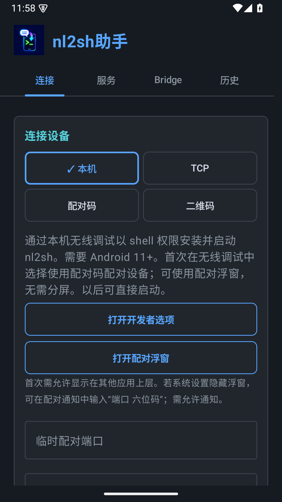
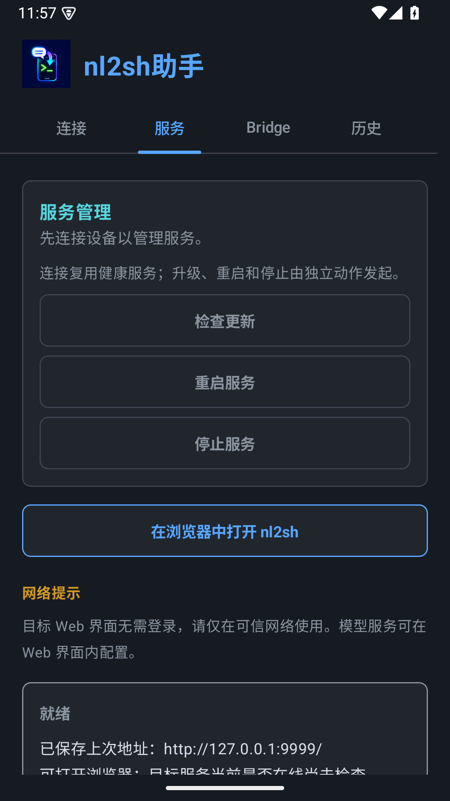
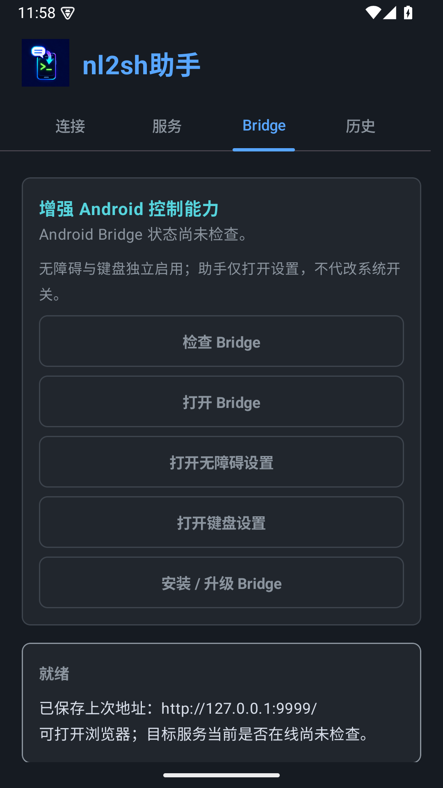
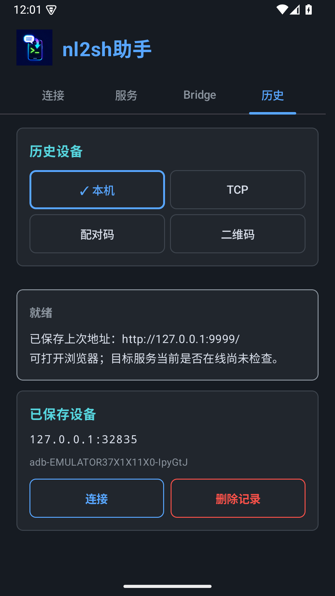

# 界面与视觉规范

界面使用 Compose + Navigation3，按功能分为“连接”“服务”“Bridge”“历史”四个 Tab：连接页只显示当前方式的表单；服务页提供更新、重启、停止和浏览器入口；Bridge 页提供诊断、安装与系统设置；历史页按连接方式筛选并按需渲染记录。Tab 切换保留输入和各页滚动位置，处理中仍可查看其他模块，重复业务操作保持禁用。返回键从其他 Tab 回到连接页；旋转后恢复当前 Tab，配对秘密不跨旋转保存。每页提供同一操作状态。

助手沿用 nl2sh 的深色界面、灰白正文和青蓝交互层级，系统浅色模式下也保持一致。图标保留品牌蓝紫渐变，应用内功能界面使用统一语义色板。

连接区的 TCP ADB、配对码、二维码按钮使用勾号和蓝色边框标明当前方式；配对码与二维码均用于 Android 无线调试。选中按钮仍可点击，只有执行任务时才禁用切换、输入和部署，并显示“正在处理…”。

状态区分别显示“就绪”“处理中”“已启动”“需注意”“失败”。蓝色代表处理中，绿色只用于确认启动成功，黄色用于注意事项，红色用于错误；详细信息保持灰白，不依赖颜色判断结果。部署明确显示连接复用、暂存校验、备份、启动和恢复；失败状态说明回滚是否完成。配对成功但未发现连接服务会提示“需注意”。保存的上次 URL 不代表目标服务当前在线。

历史设备按连接方式分组；长地址和 GUID 可以换行，连接与删除按钮位于信息下方。“删除记录”只移除助手历史，不撤销设备授权。二维码弹窗为深色，二维码本身保留黑白和完整静区；取消后停止发现并显示取消状态。

界面支持系统字体缩放和窄屏滚动，窄屏使用较大字体时连接方式自动纵排；按钮触摸区域至少 48dp；首次打开不弹出键盘。网络提示保留 Web 无需登录、仅在可信网络使用的说明。浏览器内打开的 nl2sh Web 由 nl2sh 项目维护。

贡献者改动界面前必须阅读仓库根目录 [UI_DESIGN.md](../../UI_DESIGN.md) 和 [AGENTS.md](../../AGENTS.md)。界面使用 Jetpack Compose；色值集中在 `colors.xml`，窗口主题和 Compose 语义主题分别由 `themes.xml` 与 `Nl2shTheme.kt` 管理。

## 页面组织

界面按功能独立组织，不再把所有卡片堆在一个纵向页面。

以下为 API 35 模拟器上的四个页面；当前会话尚未连接目标，保存的浏览器入口不代表服务在线。

| 连接 | 服务 |
|---|---|
|  |  |

| Bridge | 历史 |
|---|---|
|  |  |

服务管理纵排显示检查更新、重启和停止，连接目标后启用；执行前以深色确认框说明影响。停止后为就绪，旧版兼容服务显示需注意。

增强 Android 控制能力卡片纵向排列诊断和五个动作，至少 48dp。漂移仅用短 warning 提示，详细版本/服务状态保持中性；安装使用深色确认框，说明证书校验、签名冲突停止和手动启用服务。未检查或无法认证时明确显示未知。

本机为默认连接方式，与 TCP、配对码、二维码共四项，通常两列，窄屏大字体纵排。本机表单提供开发者选项入口、临时配对端口、掩码六位码和可选连接端口；配对与连接端口说明保留中性色，历史单独分组。

本机配对增加深色可拖动浮窗，无需系统设置支持分屏。标题拖动、收起/展开和关闭操作与滚动表单支持窄屏、大字体；输入六位码保持掩码且不保存。配对成功明确标为已配对，返回助手后才启动安装。窗口首次打开不弹键盘，点击输入获得焦点并显示边框。

系统隐藏浮窗时可用配对通知回复兼容入口；系统回复框没有应用密码掩码，发送内容不回显。通知状态不等于 nl2sh 服务在线。

下载和 ADB 推送在共享状态卡片显示进度条、字节计数及百分比。传输到 100% 后继续显示设备确认、签名/摘要校验、安装与启动阶段，不代表已经安装成功；缓存命中显示缓存校验。不可量化阶段显示不定进度条，失败、取消或结束后清除进度。nl2sh 与 Bridge 安装使用相同的进度显示。

离线缓存安装完成后使用警告状态，保留缓存版本与未确认最新版本的说明；同版本或更新的目标保留现有程序。
