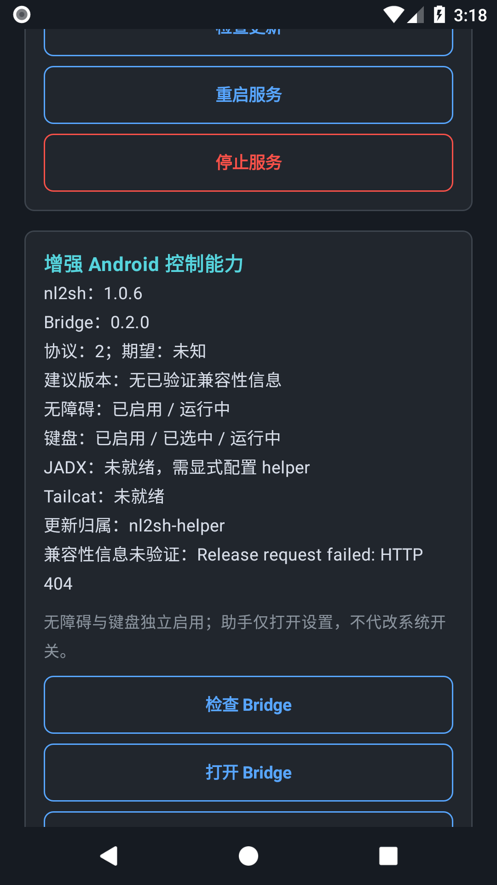

# 连接与部署指南

助手是 Android ADB 客户端和 Web 启动器，与无障碍/键盘伴侣 [android-bridge](https://github.com/nl2sh/android-bridge) 及 [JADX helper](https://github.com/nl2sh/jadx-helper) 分开维护，不包含模型 Agent 或 A2A/MCP 网关。控制端需要 Android API 26+；目标设备需要 ARM64、ARMv7 或 x86_64 发布程序，并允许从 `/data/local/tmp` 执行。

## 界面

连接方式、状态和历史遵循 nl2sh 深色语义视觉规范，详见[界面与视觉规范](design.md)。当前方式以勾号标识，处理中禁用重复操作；状态详情和错误均可换行、滚动。

## 连接

- **TCP ADB：**输入目标地址和 ADB 连接端口。需要事先自行开启 TCP ADB；助手不会代为开启。首次连接在目标设备批准 RSA 授权。
- **配对码：**Android 11+ 目标设备的无线调试提供临时配对地址、配对端口和六位码。助手配对后发现独立的连接服务；配对端口不是连接端口。
- **二维码：**在助手显示二维码，用目标设备无线调试的二维码扫描入口扫描。两端需处于支持 multicast/mDNS 发现的同一网络。控制端不需要相机权限，每次二维码尝试生成新密码。

历史记录按连接方式分开，只保存成功连接，包含地址、端口、无线 GUID 和更新时间，不保存配对码或二维码密码。无线历史重连先搜索 GUID 十秒，再尝试上次地址。删除历史条目只删除记录，不撤销目标的 ADB 授权；需要撤销时到目标设备开发者设置操作。

## 连接、更新与服务管理

“连接 / 首次安装”和历史“连接”先检查已安装程序。健康的原生服务直接复用，不查询 Release、不下载、不推送、不重启；已安装但停止的服务只启动现有程序。未安装时才下载最新发布并安装。连接后，“服务管理”提供独立的“检查更新”“重启服务”“停止服务”；这些动作先展示确认，停止/重启会取消任务及待决审批，保留配置与会话。重新发现无线设备 GUID 后仍使用同一动作。

原生生命周期协议 1 通过 `nl2sh service ... --json` 管理状态；助手按返回的实际端口构造浏览器地址。设备内健康检查与控制端 `/healthz`、`/api/info` 检查分别确认状态、PID、运行版本和端口，不假定始终是 9999。保存的浏览器地址不代表当前在线。连接旧版受管 `nohup` 服务时显示兼容提示，保留旧 PID/可执行文件与 Web 检查，不自动迁移或升级；旧版仍需要固定 9999 可用。显式更新后，支持原生协议的版本采用新管理方式。

## 安装与更新流程

1. 连接上限 45 秒。读取目标 ABI，原生 `x86_64` 优先于翻译的 ARM ABI，其次 `arm64-v8a`、`armeabi-v7a`；不支持 x86 发布包。
2. 首次安装或显式更新查询 GitHub `nl2sh/nl2sh` 最新 Release，要求匹配 `nl2sh-android-ABI` 和 `.sha256`，使用 HTTPS。无版本选择或 Gitee 回退。
3. 缓存命中也重新获取摘要并复算文件；程序上限 32,000,000 bytes、元数据 512 KiB、摘要 1024 bytes。文本 I/O 错误最多尝试三次，不代表自动重试整个部署。
4. 相同目标版本与摘要直接复用服务。不同程序先上传 `/data/local/tmp/nl2sh.download`，验证设备摘要及 `--version`，此时现有服务继续运行。原程序校验后备份到 `nl2sh.previous`，再停止受管服务、原子重命名并启动新程序。
5. 新服务必须通过目标版本、实际 PID/端口及控制端 Web 检查。失败或取消时，在关闭 ADB 客户端前尝试停止新服务、隔离 `nl2sh.failed`、校验并恢复 previous，再检查旧版本服务。不能完成回滚时如实报告，保留文件供检查；断开 ADB、权限异常或损坏备份可能需要人工恢复，不能声称已恢复。
6. 成功后记录相邻 `nl2sh.owner.json`，包括 Helper 归属、版本、摘要和 GitHub 来源，不包含 ADB 配对秘密或模型凭据。previous 保留到下一次更新；旧助手目录内的程序仅在成功后清理。

程序默认位于 `/data/local/tmp/nl2sh`。助手不传 `--config`、不提供 API Key；nl2sh 使用自身默认配置规则。原生 service 的锁、状态和日志位于默认配置旁的 `config.service/`；兼容旧服务的 `helper.pid` 与 `nl2sh-web.log` 位于 `/data/local/tmp/nl2sh-helper/`。在控制端打开返回的实际 URL，配置模型并使用 Agent。

## 权限与排障

Manifest 申请网络与 Wi-Fi multicast 权限，允许目标 Web 的明文访问，并禁用应用备份。Release 下载要求 HTTPS。目标 Web 当前监听所有 IPv4 接口且无需登录，应在可信网络使用。Web 工具仍经过原生安全和浏览器确认链；ADB 安装命令属于用户显式发起的安装操作。

配对成功但连接失败时，核对当前连接端口和 multicast 路由；配对与连接端口不同且可能变化。Release 查询失败时检查 GitHub API/资产可达性、限流及 ABI 对应的两个资产。摘要不一致会报错，不应跳过校验。原生服务会返回可用端口；控制端必须能访问实际端口。启动失败时通过已授权 ADB 查看 `config.service/service.log`；兼容旧服务查看 `/data/local/tmp/nl2sh-helper/nl2sh-web.log`。更新错误会注明回滚是否完成。

## 构建

使用 JDK 17、Android SDK Platform 36、仓库内 Gradle 9.1.0 Wrapper 和 Android Gradle Plugin 9.0.1。应用 minSdk 26、targetSdk 35；ADB 依赖固定为 JitPack 的 `com.github.Ernest-su:adb:v0.3.0`。

```sh
./gradlew --no-daemon :app:testDebugUnitTest :app:assembleDebug :app:lintDebug
adb install -r app/build/outputs/apk/debug/app-debug.apk
```

应用 ID 为 `ernest.nl2sh.helper`。release 支持本地密钥配置与 GitHub Actions 签名，详见[签名构建与发布](releasing.md)；不要提交 `local.properties`、构建输出或签名凭据。单元测试覆盖 ABI/ELF/摘要、缓存及取消/失败恢复；端到端模拟器测试见下节，不等同于厂商真机或无线配对验收。

## 可复现的生命周期验证

仅在可重置的 x86_64 Android 模拟器执行：准备真实程序和故意启动失败的 Android ELF，设置已授权 TCP ADB 以及 Web 路由，测试不会访问发布网络。覆盖连接不下载/不重启、更新失败恢复旧程序/归属、成功更新并记录 Helper 归属，再连接保持 PID。测试安装和覆盖目标默认程序，请勿对生产设备执行。

```sh
python3 scripts/prepare-runtime-fixtures.py --runtime ../nl2sh/target/x86_64-linux-android/release/nl2sh
./gradlew --no-daemon :app:assembleDebug :app:assembleDebugAndroidTest
adb install -r app/build/outputs/apk/debug/app-debug.apk
adb install -r app/build/outputs/apk/androidTest/debug/app-debug-androidTest.apk
adb shell am instrument -w -r -e class ernest.nl2sh.helper.RuntimeLifecycleTest \
  -e target_host TARGET_ADB_HOST -e adb_port TARGET_ADB_PORT -e web_port TARGET_WEB_PORT \
  -e runtime_version RUNTIME_VERSION \
  ernest.nl2sh.helper.test/androidx.test.runner.AndroidJUnitRunner
```

准备脚本要求 ANDROID_NDK_HOME/ANDROID_NDK_ROOT、rustc 及 x86_64-linux-android target；fixture 仅在忽略的 app/build 内，正式 APK 不包含它们。Web 路由必须允许控制端访问服务实际端口。

发布下载先验证签名兼容性 Manifest，再验证原生资产的 SHA-256、精确大小与独立 GPG 签名。公钥指纹固定为 `5230D3A7CCBEED4616D39C51FC6AD1BC63F7D4D8`，网络不能替换信任根。Manifest 要求助手版本与 service 协议兼容；无签名发布不能用于新安装或显式升级。已安装健康服务仍可连接，不查询发布。

签名消费验证：18 项单元测试及 debug/release 构建、lint 通过；API 26 真实设备测试覆盖固定公钥、签名夹具认证、内容篡改拒绝、Manifest URL 漂移拒绝，以及原有连接复用和失败升级回滚。生产签名由发布工作流执行，本地可暂缓。

## Android Bridge 管理

连接设备后，“增强 Android 控制能力”提供检查、安装/升级、打开 Bridge、打开无障碍设置及键盘设置。检查显示已安装版本/协议、签名 Manifest 推荐版本，以及无障碍和键盘各自启用/运行状态；版本漂移明确提示。检查失败时兼容性信息为未知，不把未认证信息当成建议。连接健康服务本身不查询发布；只有显式检查/安装 Bridge 才获取该原生版本的签名 Manifest。

安装前验证 GPG 签名、精确大小、SHA-256、APK 包名/版本及证书摘要；设备暂存文件再次核对 SHA-256，使用 `pm install -r`，安装后核对实际版本和协议，再打开应用。签名冲突停止并保留已有应用，不自动卸载或更换密钥。助手只打开设置，不写入系统无障碍或输入法开关，不改变原生服务 PID。两项服务独立，需你在目标设备手动启用。

在一次性模拟器准备测试时，`scripts/prepare-runtime-fixtures.py --runtime <x86_64 Android binary> --bridge <signed Bridge APK>` 可生成测试资产，再构建 `:app:assembleDebugAndroidTest`。`BridgeManagementTest` 通过明确 ADB/Web 参数验证证书拒绝、真实覆盖安装、原生 PID 和启用选项保持，以及三个打开入口。测试资产不提交，不读取生产私钥。

扩展诊断同时显示通过 PID/版本/实际端口验证的 `/api/info` 中的 JADX、Tailcat 与更新归属；无法核验时显示未知。API 26 真实 Bridge 管理回归、18 项单元测试和 debug/release 构建/lint 通过；界面覆盖正常竖屏、320dp/两倍字体确认框、窄横屏底部动作。旋转保留所选目标但清除过期诊断，长确认正文可滚动。



显式更新时，即使已认证目标二进制摘要相同，也登记 Helper 管理归属；复用健康服务，不推送文件或重启。普通连接不改变安装归属。

## 本机安装与启动

选择“本机”，在 Android 11+ 的开发者选项中开启无线调试。首次选择“使用配对码配对设备”，建议分屏将临时配对端口和六位码填入助手。配对通过 `127.0.0.1` 完成，不需要填写 Wi-Fi 地址。配对后自动发现本机连接服务；若 ROM 不支持自发现，填写无线调试主页显示的连接端口，再点击“启动 / 首次安装 nl2sh”。连接端口与配对端口不同。已配对时将配对字段留空；配对身份在发现或安装失败后仍保留，不保存六位码。

以后直接点击启动或本机历史连接。端口变化时自动重新发现，失败时尝试上次端口，也可手动输入当前端口。撤销授权后需重新配对；重启后可能需再次开启无线调试。Android 10 及以下仍使用远程连接方式。

本机与远程模式共享签名验证、ABI 选择、安装、更新回滚、服务及 Bridge 管理。程序仍位于 `/data/local/tmp/nl2sh` 并以 shell 权限运行，浏览器和健康检查使用 `http://127.0.0.1:<实际端口>/`。原生服务脱离 ADB 会话，关闭助手后可继续运行；停止服务、设备重启或系统清理进程会结束运行。Web 仍监听所有 IPv4 接口，本机入口不改变监听范围。

### 本机端到端回归

`LocalRuntimeTest` 仅对一次性 Android 11+ 模拟器执行：默认路径必须尚未安装 nl2sh，使用前文准备的真实 x86_64 夹具、开启无线调试并保持配对码窗口有效。安装 debug 与 androidTest APK 后执行：

```sh
adb shell am instrument --user 0 -w -r -e class ernest.nl2sh.helper.LocalRuntimeTest \
  -e disposable_local_device yes -e pairing_port PAIRING_PORT -e pairing_code PAIRING_CODE \
  -e connection_port CONNECTION_PORT -e runtime_version RUNTIME_VERSION \
  ernest.nl2sh.helper.test/androidx.test.runner.AndroidJUnitRunner
```

测试使用真实 TLS 配对和回环连接，检查 shell UID、首次安装、实际 Web 地址、历史保存、重连 PID 保持、重启及停止。测试安装使用已准备的真实二进制夹具，发布下载与签名认证由独立测试覆盖；不要把它解释为生产 Release 下载验收。新增本机匹配/历史测试后共有 21 项单元测试。已在 API 35 模拟器通过上述端到端测试及 debug/release 构建和 lint；厂商 ROM 真机兼容性仍需分别验证。
